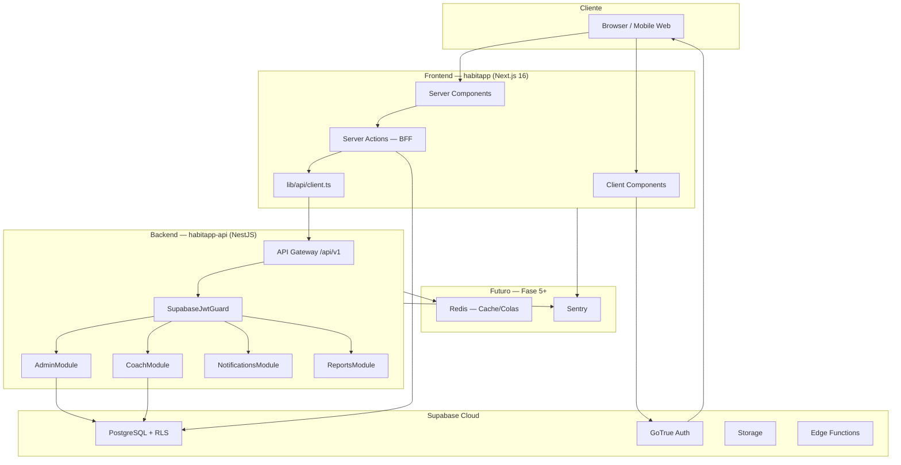
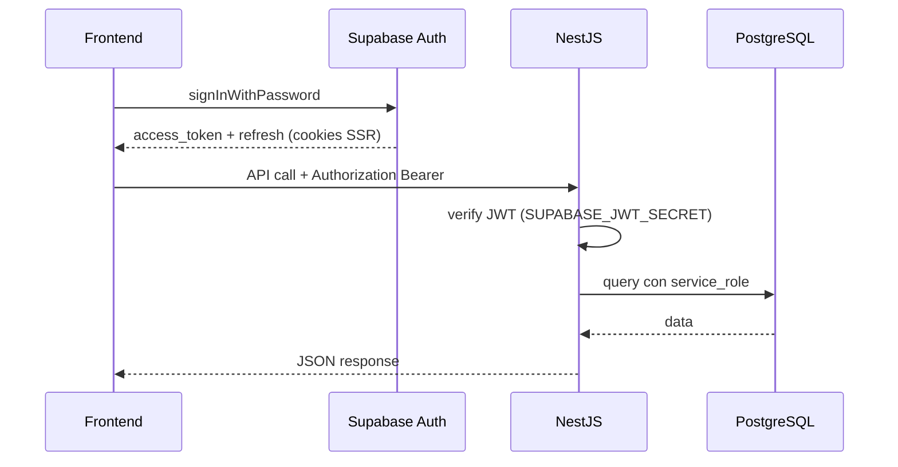
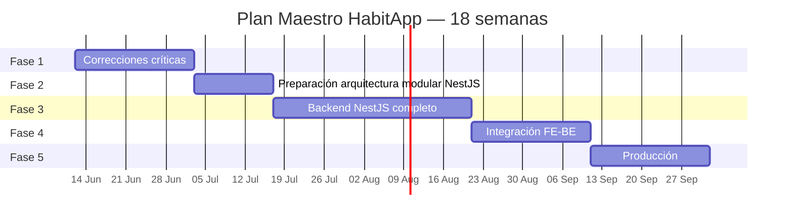
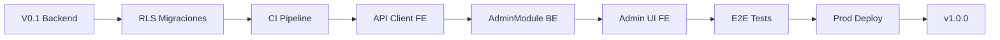
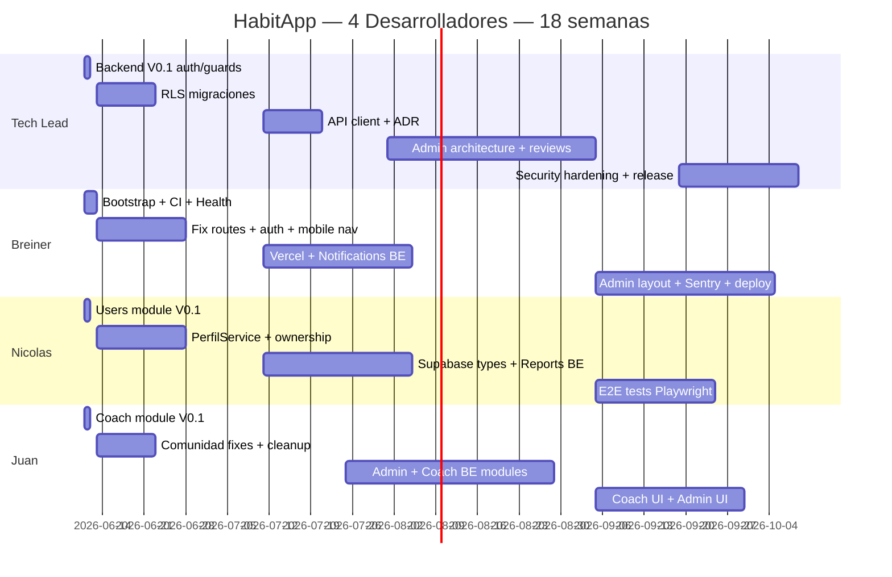

# PLAN MAESTRO HABITAPP V1

**Documento:** Guía oficial de ejecución del proyecto  
**Versión:** 1.0  
**Fecha:** 11 de junio de 2026  
**Estado:** Aprobado para ejecución  
**Alcance:** Frontend (Next.js) + Backend (NestJS) + Supabase  
**Equipo:** 4 desarrolladores  

---

> **Documento vigente:** este plan maestro es la guía activa para corregir imperfecciones del frontend ya desarrollado y construir el backend propio con NestJS. El plan de 24 horas del backend V0.1 queda como documento histórico de una entrega inmediata ya presentada.

## Índice

1. [Resumen Ejecutivo](#1-resumen-ejecutivo)
2. [Arquitectura Objetivo](#2-arquitectura-objetivo)
3. [Estrategia GitFlow Oficial](#3-estrategia-gitflow-oficial)
4. [Estrategia Git Semántico](#4-estrategia-git-semántico)
5. [Organización Oficial del Equipo](#5-organización-oficial-del-equipo)
6. [Planificación por Fases](#6-planificación-por-fases)
7. [Planificación por Features](#7-planificación-por-features)
8. [Cronograma Completo](#8-cronograma-completo)
9. [Diseño Completo del Backend NestJS](#9-diseño-completo-del-backend-nestjs)
10. [Backlog GitHub](#10-backlog-github)
11. [Riesgos Técnicos](#11-riesgos-técnicos)
12. [MVP Productivo](#12-mvp-productivo)
13. [Organización Documental](#13-organización-documental)

---

> **Checklist de control:** el avance por requerimientos, porcentajes estimados y frontera Supabase/NestJS se controla en `.docs/planeacion/00-general/checklist-requerimientos-progreso.md`.

# 1. RESUMEN EJECUTIVO

## Estado actual del proyecto

HabitApp cuenta con un **frontend funcional ya realizado** en Next.js, Supabase y Tailwind CSS. El nuevo objetivo del proyecto es corregir las imperfecciones del frontend, reforzar seguridad y evolucionar hacia un **proyecto híbrido** con backend propio en NestJS.

| Área | Estado | Nota |
|------|--------|------|
| Frontend core (hábitos, comunidad) | ✅ Funcional | Arquitectura limpia post-PR #24 |
| Módulo Admin | ❌ Pendiente | Solo en middleware |
| Módulo Entrenador | ⚠️ Parcial | Lógica en frontend + Supabase directo |
| Backend propio | 🟡 En inicio | V0.1 inmediato ya presentado; evolución guiada por este plan maestro |
| RLS Supabase | ⚠️ Incompleto | Scripts en `.docs/base-datos/sql/`, pendientes de migraciones versionadas |
| CI/CD | ❌ Ausente | |
| Tests | ❌ Ausente | |

## Objetivos del plan maestro

1. Consolidar el frontend existente (Next.js + Supabase + Tailwind CSS) corrigiendo seguridad, rutas, documentación y deuda técnica.
2. Establecer **contratos API** y capa de integración frontend ↔ backend (Fase 2, semanas 3–5).
3. Desarrollar **backend propio NestJS** para Admin, Entrenador, Notificaciones y Reportes (Fase 3, semanas 5–10).
4. **Integrar** frontend con backend de forma gradual, sin romper flujos existentes (Fase 4, semanas 10–13).
5. Alcanzar **MVP productivo** desplegable (Fase 5, semanas 13–18).

## Decisión arquitectónica oficial

HabitApp evoluciona hacia un **proyecto híbrido**: frontend existente en Next.js/Supabase y backend propio con **arquitectura modular basada en NestJS e inspirada en principios de Clean Architecture**. Esta decisión es oficial para el backend y complementa la arquitectura frontend existente. Reemplaza cualquier propuesta de Clean Architecture estricta con carpetas `domain/`, `application/`, `infrastructure/` y `presentation/` replicadas por cada módulo.

La arquitectura frontend realizada se mantiene como base del sistema actual. Para el backend se adopta una separación profesional de responsabilidades mediante módulos de negocio, controllers, services, repositories, DTOs y entities. El objetivo es equilibrar escalabilidad, mantenibilidad, productividad del equipo, simplicidad y entregas académicas frecuentes.

## Arquitectura objetivo (visión 6 meses)

**Proyecto híbrido Next.js + Supabase + NestJS:** Supabase mantiene Auth, PostgreSQL, RLS y operaciones directas seguras del usuario; NestJS concentra lógica privilegiada, orquestación, integraciones, administración, entrenador, reportes, notificaciones y operaciones con `service_role`.

## Justificación de NestJS

- Alineación TypeScript con frontend Next.js (tipos compartidos futuros).
- Estructura modular mapea a roles (Admin, Coach, Users).
- Guards declarativos equivalentes a RLS en capa aplicación.
- Swagger nativo para repo independiente.
- `.env.example` del frontend ya anticipaba NestJS en `:4000/api/v1`.
- Ecosistema SaaS: colas, cron, throttling, caché Redis.

## Justificación arquitectura modular NestJS inspirada en Clean Architecture

| Mantener en Supabase | Mover a NestJS |
|---------------------|----------------|
| Auth (JWT, OAuth futuro) | Moderación admin |
| CRUD hábitos del propio usuario | Gestión usuarios y roles |
| RLS para aislamiento de datos | Dashboard entrenador avanzado |
| Triggers atómicos (puntos, perfil) | Reportes con caché |
| Storage (avatars) | Notificaciones email/push |
| Realtime (futuro) | Integraciones (Stripe, analytics) |

**Strangler Fig Pattern:** migrar módulo a módulo sin big-bang rewrite.

## Principios oficiales

- Organizar el backend por **módulos de negocio**: `users`, `coach`, `admin`, `notifications`, `reports`.
- Mantener carpetas internas simples y consistentes: `controllers/`, `services/`, `repositories/`, `dto/`, `entities/`.
- Centralizar responsabilidades transversales en `common/`, `config/`, `auth/` y `supabase/`.
- Evitar estructuras excesivamente complejas tipo `domain/application/infrastructure/presentation` dentro de cada módulo.
- Usar repositories para acceso a Supabase y services para reglas de negocio.
- Documentar APIs con Swagger y proteger endpoints con guards y decorators reutilizables.

---

# 2. ARQUITECTURA OBJETIVO

## Estructura oficial del backend NestJS

```text
src/
├── config/
├── common/
│   ├── decorators/
│   ├── guards/
│   ├── filters/
│   ├── interceptors/
│   ├── pipes/
│   └── dto/
│
├── supabase/
├── auth/
├── health/
│
├── users/
│   ├── controllers/
│   ├── services/
│   ├── repositories/
│   ├── dto/
│   ├── entities/
│   └── users.module.ts
│
├── coach/
│   ├── controllers/
│   ├── services/
│   ├── repositories/
│   ├── dto/
│   ├── entities/
│   └── coach.module.ts
│
├── admin/
│   ├── controllers/
│   ├── services/
│   ├── repositories/
│   ├── dto/
│   ├── entities/
│   └── admin.module.ts
│
├── notifications/
├── reports/
└── main.ts
```

Esta estructura es deliberadamente modular y pragmática. No se implementará una Clean Architecture estricta por módulo; se tomarán sus principios útiles, como inversión de dependencias, separación de responsabilidades y límites claros entre lógica de negocio y acceso a datos.

## Diagrama de componentes



## Flujo de autenticación



## Mapa de APIs (objetivo completo)

| Prefijo | Módulo | Auth | Fase |
|---------|--------|------|------|
| `/health` | Health | Público | V0.1 ✅ |
| `/users` | Users | JWT | V0.1 ✅ |
| `/coach` | Coach | JWT + Entrenador | V0.1 ✅ |
| `/admin/users` | Admin | JWT + Admin | Fase 3 |
| `/admin/moderation` | Admin | JWT + Admin | Fase 3 |
| `/admin/analytics` | Admin | JWT + Admin | Fase 4 |
| `/notifications` | Notifications | JWT | Fase 3 |
| `/reports` | Reports | JWT | Fase 4 |

---

# 3. ESTRATEGIA GITFLOW OFICIAL

## Ramas permanentes

| Rama | Propósito | Protección |
|------|-----------|------------|
| `main` | Producción — siempre desplegable | PR required, 1 approval (TL), CI green |
| `develop` | Integración continua | PR required, CI green |

## Ramas temporales

| Prefijo | Uso | Base | Merge a | Ejemplo |
|---------|-----|------|---------|---------|
| `feature/*` | Nueva funcionalidad | `develop` | `develop` | `feature/be-users-module` |
| `bugfix/*` | Bug no urgente | `develop` | `develop` | `bugfix/fe-fix-dashboard-routes` |
| `hotfix/*` | Bug crítico producción | `main` | `main` + `develop` | `hotfix/fix-jwt-expiry` |
| `release/*` | Estabilización pre-release | `develop` | `main` + `develop` | `release/1.0.0` |
| `chore/*` | Mantenimiento, deps, CI | `develop` | `develop` | `chore/setup-github-actions` |

## Reglas del equipo

1. Nunca push directo a `main`.
2. Features < 3 días — dividir si crece.
3. Un dev por módulo por rama.
4. Sync `develop` diario.
5. PR con template + issue link.
6. TL aprueba PRs en `common/`, `guards`, `supabase/`, seguridad.
7. Squash merge en features; merge commit en releases.

---

# 4. ESTRATEGIA GIT SEMÁNTICO

## Formato oficial

```
<tipo>(<scope>): <descripción imperativa en minúsculas>
```

## Tipos permitidos

| Tipo | Cuándo | Ejemplo |
|------|--------|---------|
| `feat` | Nueva funcionalidad | `feat(coach): agregar endpoint de rutinas` |
| `fix` | Bug | `fix(auth): corregir validación JWT expirado` |
| `docs` | Documentación | `docs: actualizar README habitapp-api` |
| `refactor` | Sin cambio comportamiento | `refactor(users): extraer UsersRepository` |
| `test` | Tests | `test(health): agregar e2e health check` |
| `chore` | Mantenimiento | `chore: actualizar dependencias nestjs` |
| `build` | Build | `build: configurar Dockerfile multi-stage` |
| `ci` | CI/CD | `ci: agregar workflow lint-and-build` |

## Scopes oficiales

**Frontend:** `auth`, `habitos`, `comunidad`, `perfil`, `layout`, `api`, `middleware`  
**Backend:** `config`, `auth`, `users`, `coach`, `admin`, `health`, `common`, `swagger`

---

# 5. ORGANIZACIÓN OFICIAL DEL EQUIPO

## Matriz de roles

| | **Carlos (TL)** | **Breiner (D2)** | **Nicolas (D3)** | **Juan (D4)** |
|---|-------------|-----------------|--------------|---------------|
| **Rol principal** | Architect + Backend Lead | Frontend Lead + DevOps | Full-stack — Usuario | Full-stack — Comunidad/Coach |
| **Rol secundario** | Code review crítico | CI/CD + Infra | QA + Tests FE | Tests BE + Docs API |
| **Repo principal** | habitapp-api | habitapp | habitapp | habitapp-api |
| **Módulos owner** | auth, common, config | layout, auth UI, CI | habitos, perfil, users | comunidad, coach, admin |

## Ceremonias Scrum

| Ceremonia | Frecuencia | Duración |
|-----------|------------|----------|
| Daily standup | Diaria | 15 min |
| Sprint planning | Cada 2 semanas | 1.5 h |
| Refinement | Semanal | 45 min |
| Demo/Sprint review | Cada 2 semanas | 45 min |
| Retrospective | Cada 2 semanas | 30 min |

**Sprint:** 2 semanas · **Velocity:** 40–50 SP/sprint

---

# 6. PLANIFICACIÓN POR FASES



## FASE 1 — Correcciones críticas (Semanas 1–3)

**Objetivos:** Seguridad RLS, bugs frontend, CI mínimo.  
**Entregables:** Migraciones RLS, rutas corregidas, getUser(), CI ambos repos, nav móvil.  
**Criterio:** RLS completo + CI green + cero `/dashboard/*`.

## FASE 2 — Preparación modular NestJS (Semanas 4–5)

**Objetivos:** API client, OpenAPI v1, tipos Supabase, ADR-001.  
**Criterio:** Frontend llama `/users/me` via API client.

## FASE 3 — Backend completo (Semanas 6–10)

**Objetivos:** AdminModule, Coach avanzado, Notifications, Reports, Docker, Redis.  
**Criterio:** Swagger 100%, tests >70% services, staging auto-deploy.

## FASE 4 — Integración (Semanas 11–13)

**Objetivos:** Admin UI, entrenador via API, E2E Playwright.  
**Criterio:** Admin cambia roles desde UI; 5+ E2E en CI.

## FASE 5 — Producción (Semanas 14–18)

**Objetivos:** Deploy prod, Sentry, security hardening, v1.0.0.  
**Criterio:** Checklist MVP Productivo 100%.

---

# 7. PLANIFICACIÓN POR FEATURES

> Cada feature = 1 rama GitFlow + 1 issue GitHub + owner + revisor.

## Leyenda

| Prioridad | Significado |
|-----------|-------------|
| P0 | Bloqueante — hacer ya |
| P1 | Alta — sprint actual |
| P2 | Media — próximo sprint |
| P3 | Baja — backlog |

| Estimación | Story Points |
|------------|--------------|
| XS | 1–2 SP (~ medio día) |
| S | 3 SP (~ 1 día) |
| M | 5 SP (~ 2–3 días) |
| L | 8 SP (~ 1 semana) |
| XL | 13 SP — **dividir** |

---

## ANTECEDENTE — Entrega 24h ya presentada (Backend V0.1)

> Esta entrega se conserva como antecedente histórico. No define el trabajo activo actual; el trabajo vigente inicia con correcciones críticas del frontend y evolución planificada del backend.

| Rama | Descripción | Responsable | Revisor | P | Est. | Dep. |
|------|-------------|-------------|---------|---|------|------|
| `feature/be-nest-bootstrap` | Bootstrap NestJS + scripts + ESLint | Breiner | TL | P0 | S | — |
| `feature/be-supabase-auth` | Guards JWT + SupabaseService | TL | — | P0 | M | be-nest-bootstrap |
| `feature/be-health-module` | GET /health + e2e | Breiner | TL | P0 | XS | be-nest-bootstrap |
| `feature/be-users-module` | Users endpoints (3) | Nicolas | TL | P0 | M | be-supabase-auth |
| `feature/be-coach-module` | GET /coach/clients | Juan | TL | P0 | M | be-supabase-auth |

---

## FASE 1 — Correcciones críticas

| Rama | Descripción | Responsable | Revisor | P | Est. | Dep. |
|------|-------------|-------------|---------|---|------|------|
| `feature/be-supabase-migrations` | Migraciones CLI + RLS completo [COMPLETADO] | TL | Breiner | P0 | L | V0.1 |
| `feature/fe-fix-dashboard-routes` | Eliminar `/dashboard/*` [COMPLETADO] | Breiner | Nicolas | P0 | S | — |
| `feature/fe-auth-hardening` | getUser(), callback, reset password [COMPLETADO] | Breiner | TL | P0 | M | — |
| `feature/fe-env-example` | .env.example + gitignore fix [COMPLETADO] | Breiner | TL | P0 | XS | — |
| `feature/fe-habito-ownership` | Validar ownership en services | Nicolas | TL | P0 | S | — |
| `feature/fe-mobile-nav` | Drawer/bottom nav móvil [COMPLETADO] | Breiner | Juan | P1 | M | — |
| `feature/fe-perfil-service` | Extraer PerfilService [COMPLETADO] | Nicolas | Breiner | P1 | M | — |
| `feature/fe-cleanup-dead-code` | Eliminar temp_hash, SidebarNav | Juan | Breiner | P2 | S | — |
| `chore/fe-setup-ci` | GitHub Actions habitapp [COMPLETADO] | Breiner | TL | P0 | M | — |
| `chore/be-setup-ci` | GitHub Actions habitapp-api [COMPLETADO] | Breiner | TL | P0 | S | V0.1 |
| `bugfix/fe-foro-navigation` | ForoComunidadCard → detalle | Juan | Nicolas | P2 | XS | — |

---

## FASE 2 — Preparación arquitectura modular NestJS

| Rama | Descripción | Responsable | Revisor | P | Est. | Dep. |
|------|-------------|-------------|---------|---|------|------|
| `feature/fe-api-client` | lib/api/client.ts + JWT [COMPLETADO] | TL | Breiner | P0 | M | V0.1 |
| `feature/be-openapi-v1` | Congelar spec OpenAPI [COMPLETADO] | TL | Juan | P0 | S | V0.1 |
| `feature/fe-supabase-types` | database.types.ts generado | Nicolas | TL | P1 | S | be-supabase-migrations |
| `feature/fe-unify-habit-create` | Un solo flujo crear hábito | Nicolas | Breiner | P1 | M | — |
| `feature/fe-require-user-helper` | requireUser/requireRole | Nicolas | TL | P1 | S | fe-auth-hardening |
| `chore/docs-adr-nestjs-modular-architecture` | ADR arquitectura modular NestJS [COMPLETADO] | TL | Todos | P1 | XS | — |
| `chore/fe-deploy-vercel` | Vercel preview deploys (Nativo Vercel) [COMPLETADO] | Breiner | TL | P1 | S | fe-setup-ci |

---

## FASE 3 — Backend NestJS completo

| Rama | Descripción | Responsable | Revisor | P | Est. | Dep. |
|------|-------------|-------------|---------|---|------|------|
| `feature/be-admin-users` | Admin CRUD usuarios [COMPLETADO] | Juan | TL | P0 | L | be-users-module |
| `feature/be-admin-moderation` | Moderar comentarios/foros | Juan | TL | P0 | M | be-admin-users |
| `feature/be-coach-routines` | CRUD rutinas | Juan | TL | P0 | L | be-coach-module |
| `feature/be-coach-assign` | Asignar rutina a pupilo | Juan | TL | P0 | M | be-coach-routines |
| `feature/be-coach-progress` | Progreso detallado pupilo | Juan | Nicolas | P1 | M | be-coach-assign |
| `feature/be-notifications` | List + mark read + email [COMPLETADO] | Breiner | TL | P1 | L | — |
| `feature/be-reports-ranking` | Ranking con Redis cache | Nicolas | TL | P1 | M | — |
| `feature/be-reports-user` | Reporte resumen usuario | Nicolas | TL | P2 | M | — |
| `chore/be-docker` | Dockerfile + compose [COMPLETADO] | Breiner | TL | P1 | M | — |
| `chore/be-services-coverage` | Tests >70% services | Juan + Nicolas | TL | P1 | L | módulos |

---

## FASE 4 — Integración

| Rama | Descripción | Responsable | Revisor | P | Est. | Dep. |
|------|-------------|-------------|---------|---|------|------|
| `feature/fe-admin-layout` | Layout + rutas /admin [COMPLETADO] | Breiner | TL | P0 | M | admin BE |
| `feature/fe-admin-users-ui` | UI gestión usuarios | Juan | Breiner | P0 | M | admin BE |
| `feature/fe-coach-dashboard-api` | Entrenador via API | Juan | TL | P0 | L | coach BE |
| `feature/fe-api-proxy-actions` | Server Actions → backend [COMPLETADO] | TL | Nicolas | P0 | M | fe-api-client |
| `chore/e2e-critical-flows` | Playwright 5 flujos | Nicolas + Juan | Breiner | P0 | L | integración |

---

## FASE 5 — Producción

| Rama | Descripción | Responsable | Revisor | P | Est. | Dep. |
|------|-------------|-------------|---------|---|------|------|
| `feature/prod-sentry` | Sentry FE + BE [COMPLETADO] | Breiner | TL | P0 | S | — |
| `feature/prod-security-headers` | CSP, HSTS, rate limit [COMPLETADO] | TL | Breiner | P0 | M | — |
| `feature/prod-monitoring` | Health + uptime [COMPLETADO] | Breiner | TL | P1 | S | — |
| `release/1.0.0` | Release branch | TL | Todos | P0 | M | all |
| `chore/docs-privacy-terms` | Legal docs [COMPLETADO] | Breiner | TL | P0 | S | — |

---

# 8. CRONOGRAMA COMPLETO

## Calendario por sprint (2 semanas c/u)

| Sprint | Fechas | Foco | Meta |
|--------|--------|------|------|
| S0 | 11–12 Jun | **Entrega V0.1** | Backend demo |
| S1 | 13–26 Jun | Fase 1a | RLS + rutas + auth |
| S2 | 27 Jun – 10 Jul | Fase 1b | CI + nav móvil + cleanup |
| S3 | 11–24 Jul | Fase 2 | API client + OpenAPI |
| S4 | 25 Jul – 7 Ago | Fase 3a | AdminModule |
| S5 | 8–21 Ago | Fase 3b | Coach avanzado |
| S6 | 22 Ago – 4 Sep | Fase 3c | Notifications + Reports |
| S7 | 5–18 Sep | Fase 4a | Admin UI |
| S8 | 19 Sep – 2 Oct | Fase 4b | Coach UI + E2E |
| S9 | 3–16 Oct | Fase 5a | Deploy staging prod |
| S10 | 17–30 Oct | Fase 5b | Hardening + v1.0.0 |

## Ruta crítica



**Tareas en ruta crítica (no pueden retrasarse sin mover la fecha final):**

1. V0.1 Backend (12 de junio de 2026)
2. RLS migraciones (S1)
3. API client (S3)
4. AdminModule backend (S4)
5. Admin UI (S7)
6. E2E tests (S8)
7. Production deploy (S9)

## Trabajo paralelo por sprint

### S1 (paralelo — 4 devs)

| Dev | Track A | Track B |
|-----|---------|---------|
| TL | RLS migraciones | Review PRs |
| Breiner | fix-dashboard-routes | setup-ci FE |
| Nicolas | fe-auth-hardening | habito-ownership |
| Juan | cleanup + foro nav | Apoyo RLS testing |

### S4 (paralelo)

| Dev | Track |
|-----|-------|
| TL | OpenAPI + reviews + proxy actions design |
| Breiner | Notifications module |
| Nicolas | Reports ranking |
| Juan | Admin users + moderation |

## Gantt detallado — equipo completo



---

# 9. DISEÑO COMPLETO DEL BACKEND NESTJS

## Estructura objetivo (v1.0)

```
habitapp-api/
├── src/
│   ├── app.module.ts
│   ├── config/
│   ├── common/
│   │   ├── decorators/       # @Roles(), @CurrentUser()
│   │   ├── guards/           # SupabaseJwtGuard, RolesGuard
│   │   ├── filters/          # HttpExceptionFilter
│   │   ├── interceptors/     # LoggingInterceptor
│   │   ├── pipes/            # ValidationPipe config
│   │   └── dto/              # PaginationDto, ApiResponseDto
│   ├── supabase/
│   ├── auth/
│   ├── health/
│   ├── users/
│   │   ├── controllers/
│   │   ├── services/
│   │   ├── repositories/
│   │   ├── dto/
│   │   ├── entities/
│   │   └── users.module.ts
│   ├── coach/
│   │   ├── controllers/
│   │   ├── services/
│   │   ├── repositories/
│   │   ├── dto/
│   │   ├── entities/
│   │   └── coach.module.ts
│   ├── admin/
│   │   ├── admin.module.ts
│   │   ├── controllers/
│   │   │   ├── admin-users.controller.ts
│   │   │   └── admin-moderation.controller.ts
│   │   ├── services/
│   │   ├── repositories/
│   │   ├── dto/
│   │   └── entities/
│   ├── notifications/
│   ├── reports/
│   ├── redis/                # Fase 3
│   └── main.ts
├── test/
├── docker/
│   ├── Dockerfile
│   └── docker-compose.yml
├── .github/workflows/
│   └── ci.yml
└── docs/
    └── openapi.yaml
```

## Módulos — responsabilidades

| Módulo | Controllers | Services | Repositories |
|--------|-------------|----------|--------------|
| **Users** | UsersController | UsersService | UsersRepository |
| **Coach** | CoachController, RoutinesController | CoachService, RoutinesService | CoachRepository |
| **Admin** | AdminUsersController, ModerationController | AdminUsersService, ModerationService | AdminRepository |
| **Notifications** | NotificationsController | NotificationsService, EmailService | NotificationsRepository |
| **Reports** | ReportsController | ReportsService, RankingCacheService | ReportsRepository |

## Guards

```typescript
// Flujo de guards por endpoint
@UseGuards(SupabaseJwtGuard, RolesGuard)
@Roles('Administrador')
@Get()
findAll() {}
```

| Guard | Responsabilidad |
|-------|-----------------|
| `SupabaseJwtGuard` | Extrae Bearer, verifica firma JWT, adjunta `user` al request |
| `RolesGuard` | Lee `@Roles()`, consulta rol en BD o JWT claims, lanza 403 |

## DTOs — convenciones

- Sufijo `Dto` para request/response.
- `class-validator` decorators en request DTOs.
- `@ApiProperty()` en todos los campos para Swagger.
- Response DTOs sin validación — solo `@ApiProperty`.

```typescript
// Ejemplo UpdateUserRoleDto
export class UpdateUserRoleDto {
  @ApiProperty({ example: 2, description: '1=Usuario, 2=Entrenador, 3=Admin' })
  @IsInt()
  @Min(1)
  @Max(3)
  rolId: number;
}
```

## Repositories — patrón

- Un repository por agregado de dominio.
- Solo acceden a `SupabaseService` — nunca al controller.
- Mapean filas SQL → DTOs.
- Errores Supabase → excepciones NestJS (`NotFoundException`, etc.).

## Validación global

```typescript
// main.ts
app.useGlobalPipes(new ValidationPipe({
  whitelist: true,
  forbidNonWhitelisted: true,
  transform: true,
}));
```

## Swagger

- URL: `/api/docs`
- Title: `HabitApp API`
- Version: alineada con SemVer
- Bearer auth configurado para JWT Supabase
- Tags: `health`, `users`, `coach`, `admin`, `notifications`, `reports`

## Logging

- `@nestjs/common` Logger en services.
- `LoggingInterceptor` para request/response (sin loguear tokens).
- Fase 5: migrar a **Pino** (`nestjs-pino`).

## Docker

```dockerfile
# Multi-stage — Fase 3
FROM node:20-alpine AS builder
WORKDIR /app
COPY package*.json ./
RUN npm ci
COPY . .
RUN npm run build

FROM node:20-alpine AS production
WORKDIR /app
COPY --from=builder /app/dist ./dist
COPY --from=builder /app/node_modules ./node_modules
EXPOSE 4000
CMD ["node", "dist/main.js"]
```

## CI/CD (objetivo)

```yaml
# .github/workflows/ci.yml — esqueleto
name: CI
on: [pull_request, push]
jobs:
  build:
    runs-on: ubuntu-latest
    steps:
      - uses: actions/checkout@v4
      - uses: actions/setup-node@v4
        with: { node-version: '20' }
      - run: npm ci
      - run: npm run lint
      - run: npm run test
      - run: npm run build
```

## Testing — pirámide

| Nivel | Herramienta | Cobertura objetivo | Responsable |
|-------|-------------|-------------------|-------------|
| Unit | Jest | Services 70%+ | Cada owner del módulo |
| Integration | Jest + Supabase test | Repositories 50%+ | TL + owner |
| E2E | Supertest | Endpoints críticos 100% | Breiner + Juan |

---

# 10. BACKLOG GITHUB

> Copiar cada issue a GitHub Projects. Labels sugeridos: `P0`, `P1`, `P2`, `backend`, `frontend`, `security`, `devops`.

---

## EPIC 0 — Backend V0.1 ya presentado

> Epic histórico conservado para trazabilidad. No debe priorizarse nuevamente salvo que se necesite recuperar evidencia o validar decisiones tomadas durante la entrega inmediata.

### ISSUE-001: Bootstrap repositorio habitapp-api
- **Prioridad:** P0 · **Estimación:** 3 SP · **Responsable:** Breiner · **Dep.:** —
- **Descripción:** Crear repo NestJS, ESLint, scripts, `.env.example`, README instalación.
- **Criterios:** `npm run start:dev` funciona; Swagger placeholder; CI stub.

### ISSUE-002: Supabase JWT Auth Guards
- **Prioridad:** P0 · **Estimación:** 5 SP · **Responsable:** TL · **Dep.:** ISSUE-001
- **Descripción:** SupabaseService, SupabaseJwtGuard, RolesGuard, decorators @Roles @CurrentUser.
- **Criterios:** Request sin token → 401; token inválido → 401; rol incorrecto → 403.

### ISSUE-003: Health endpoint
- **Prioridad:** P0 · **Estimación:** 2 SP · **Responsable:** Breiner · **Dep.:** ISSUE-001
- **Descripción:** GET /api/v1/health + test e2e.
- **Criterios:** 200 JSON con status, version, timestamp.

### ISSUE-004: Users module V0.1
- **Prioridad:** P0 · **Estimación:** 5 SP · **Responsable:** Nicolas · **Dep.:** ISSUE-002
- **Descripción:** GET /users, GET /users/me, PATCH /users/:id/role.
- **Criterios:** Swagger documentado; tests manuales Postman OK.

### ISSUE-005: Coach module V0.1
- **Prioridad:** P0 · **Estimación:** 5 SP · **Responsable:** Juan · **Dep.:** ISSUE-002
- **Descripción:** GET /api/v1/coach/clients.
- **Criterios:** Entrenador ve pupilos; usuario normal → 403.

---

## EPIC 1 — Seguridad y deuda crítica frontend

### ISSUE-010: Migraciones Supabase CLI + RLS completo
- **Prioridad:** P0 · **Estimación:** 8 SP · **Responsable:** TL · **Dep.:** —
- **Descripción:** Crear `supabase/migrations/`, portar SQL de `.docs/base-datos/sql/`, completar políticas faltantes (amigos, retos, logros, usuario_rutina, seguimientos).
- **Criterios:** `supabase db push` exitoso; todas las tablas app tienen RLS; GRANT anon reducido.

### ISSUE-011: Corregir rutas /dashboard/*
- **Prioridad:** P0 · **Estimación:** 3 SP · **Responsable:** Breiner · **Dep.:** —
- **Descripción:** Buscar/reemplazar links y revalidatePath incorrectos.
- **Criterios:** Grep `/dashboard` en src/ = 0 resultados.

### ISSUE-012: Auth hardening — getUser() everywhere
- **Prioridad:** P0 · **Estimación:** 5 SP · **Responsable:** Breiner · **Dep.:** —
- **Descripción:** Reemplazar getSession() por getUser() en pages y actions; helper requireUser().
- **Criterios:** 0 ocurrencias getSession() en server code.

### ISSUE-013: Fix auth callback y reset password
- **Prioridad:** P0 · **Estimación:** 3 SP · **Responsable:** Breiner · **Dep.:** —
- **Descripción:** NEXT_PUBLIC_SITE_URL; whitelist `next` param en callback.
- **Criterios:** Reset password funciona en staging; open redirect imposible.

### ISSUE-014: Validar ownership en HabitoService
- **Prioridad:** P0 · **Estimación:** 3 SP · **Responsable:** Nicolas · **Dep.:** —
- **Descripción:** update/delete comparan idusuario con session user.
- **Criterios:** Test manual IDOR bloqueado.

### ISSUE-015: CI pipeline — habitapp
- **Prioridad:** P0 · **Estimación:** 5 SP · **Responsable:** Breiner · **Dep.:** —
- **Descripción:** lint + tsc + build en PR.
- **Criterios:** PR bloqueado si CI falla.

### ISSUE-016: CI pipeline — habitapp-api
- **Prioridad:** P0 · **Estimación:** 3 SP · **Responsable:** Breiner · **Dep.:** ISSUE-001
- **Descripción:** lint + test + build en PR.
- **Criterios:** CI green en develop.

### ISSUE-017: Navegación móvil
- **Prioridad:** P1 · **Estimación:** 5 SP · **Responsable:** Breiner · **Dep.:** —
- **Descripción:** Drawer o bottom nav para rutas dashboard en móvil.
- **Criterios:** Todas las rutas accesibles en viewport 375px.

### ISSUE-018: Refactor PerfilService
- **Prioridad:** P1 · **Estimación:** 5 SP · **Responsable:** Nicolas · **Dep.:** —
- **Descripción:** Extraer lógica de perfil/page.tsx a service + subcomponentes.
- **Criterios:** page.tsx < 100 líneas.

---

## EPIC 2 — Arquitectura modular NestJS

### ISSUE-020: API Client frontend
- **Prioridad:** P0 · **Estimación:** 5 SP · **Responsable:** TL · **Dep.:** ISSUE-004
- **Descripción:** `src/lib/api/client.ts` con fetch tipado, JWT from session, error handling.
- **Criterios:** GET /users/me funciona desde Server Action.

### ISSUE-021: OpenAPI spec v1 congelada
- **Prioridad:** P0 · **Estimación:** 3 SP · **Responsable:** TL · **Dep.:** ISSUE-004, ISSUE-005
- **Descripción:** Exportar y commitear openapi.yaml como contrato.
- **Criterios:** Spec versionada; cambios requieren PR + review TL.

### ISSUE-022: Generar database.types.ts
- **Prioridad:** P1 · **Estimación:** 2 SP · **Responsable:** Nicolas · **Dep.:** ISSUE-010
- **Descripción:** supabase gen types → reemplazar stub.
- **Criterios:** Tipos reflejan schemas gestion/seguimiento/comunidad.

### ISSUE-023: ADR-001 Arquitectura modular NestJS inspirada en Clean Architecture
- **Prioridad:** P1 · **Estimación:** 2 SP · **Responsable:** TL · **Dep.:** —
- **Descripción:** Documento de decisión arquitectónica en `.docs/planeacion/02-backend/`.
- **Criterios:** Aprobado por equipo.

---

## EPIC 3 — Backend módulos completos

### ISSUE-030: AdminModule — gestión usuarios
- **Prioridad:** P0 · **Estimación:** 8 SP · **Responsable:** Juan · **Dep.:** ISSUE-004
- **Descripción:** CRUD admin users, ban/unban, búsqueda paginada.
- **Criterios:** Swagger; tests unitarios AdminUsersService.

### ISSUE-031: AdminModule — moderación
- **Prioridad:** P0 · **Estimación:** 5 SP · **Responsable:** Juan · **Dep.:** ISSUE-030
- **Descripción:** DELETE comentarios, ocultar foros, listar reportes.
- **Criterios:** Solo admin accede.

### ISSUE-032: CoachModule — rutinas CRUD
- **Prioridad:** P0 · **Estimación:** 8 SP · **Responsable:** Juan · **Dep.:** ISSUE-005
- **Descripción:** POST/PATCH/DELETE rutinas; GET rutinas del entrenador.
- **Criterios:** Validación DTOs; ownership entrenador.

### ISSUE-033: CoachModule — asignar rutina
- **Prioridad:** P0 · **Estimación:** 5 SP · **Responsable:** Juan · **Dep.:** ISSUE-032
- **Descripción:** POST assign routine to client; validar relación entrenador-pupilo.
- **Criterios:** 403 si pupilo no asignado.

### ISSUE-034: NotificationsModule
- **Prioridad:** P1 · **Estimación:** 8 SP · **Responsable:** Breiner · **Dep.:** —
- **Descripción:** GET notifications, PATCH read, email via Resend.
- **Criterios:** Email de prueba enviado en staging.

### ISSUE-035: ReportsModule + Redis cache
- **Prioridad:** P1 · **Estimación:** 5 SP · **Responsable:** Nicolas · **Dep.:** —
- **Descripción:** GET ranking cached TTL 5min; GET user summary.
- **Criterios:** Redis en docker-compose; cache hit verificable.

### ISSUE-036: Docker + docker-compose
- **Prioridad:** P1 · **Estimación:** 5 SP · **Responsable:** Breiner · **Dep.:** —
- **Descripción:** Dockerfile multi-stage; compose con api + redis.
- **Criterios:** `docker compose up` levanta API en :4000.

---

## EPIC 4 — Integración frontend

### ISSUE-040: Admin UI — layout y rutas
- **Prioridad:** P0 · **Estimación:** 5 SP · **Responsable:** Breiner · **Dep.:** ISSUE-030
- **Descripción:** /admin layout, sidebar admin, role guard frontend.
- **Criterios:** Usuario normal no ve /admin.

### ISSUE-041: Admin UI — gestión usuarios
- **Prioridad:** P0 · **Estimación:** 5 SP · **Responsable:** Juan · **Dep.:** ISSUE-040
- **Descripción:** Tabla usuarios, cambio rol, paginación.
- **Criterios:** Consume backend AdminModule.

### ISSUE-042: Coach dashboard via API
- **Prioridad:** P0 · **Estimación:** 8 SP · **Responsable:** Juan · **Dep.:** ISSUE-032
- **Descripción:** Refactor /entrenador para consumir habitapp-api.
- **Criterios:** Cero queries directas Supabase en entrenador pages.

### ISSUE-043: Server Actions proxy backend
- **Prioridad:** P0 · **Estimación:** 5 SP · **Responsable:** TL · **Dep.:** ISSUE-020
- **Descripción:** Pattern: Action → apiClient → NestJS (admin/coach).
- **Criterios:** Documentado en README frontend.

### ISSUE-044: E2E Playwright — flujos críticos
- **Prioridad:** P0 · **Estimación:** 8 SP · **Responsable:** Nicolas + Juan · **Dep.:** ISSUE-041
- **Descripción:** login → hábito → admin role change → coach clients.
- **Criterios:** 5 tests en CI.

---

## EPIC 5 — Producción

### ISSUE-050: Deploy Vercel (frontend) [COMPLETADO]
- **Prioridad:** P0 · **Estimación:** 3 SP · **Responsable:** Breiner · **Dep.:** ISSUE-015
- **Descripción:** Configurado nativamente vía integración GitHub-Vercel (no requiere código adicional).
- **Criterios:** URL pública funcional para Preview Deploys y Production.

### ISSUE-051: Deploy Railway/Fly (backend)
- **Prioridad:** P0 · **Estimación:** 5 SP · **Responsable:** Breiner · **Dep.:** ISSUE-036
- **Descripción:** Staging develop auto-deploy; production manual desde main.
- **Criterios:** /health responde en URL pública staging.

### ISSUE-052: Sentry FE + BE
- **Prioridad:** P0 · **Estimación:** 3 SP · **Responsable:** Breiner · **Dep.:** ISSUE-050
- **Descripción:** Error tracking ambos repos.
- **Criterios:** Error test visible en Sentry dashboard.

### ISSUE-053: Security headers + rate limiting
- **Prioridad:** P0 · **Estimación:** 5 SP · **Responsable:** TL · **Dep.:** —
- **Descripción:** CSP, HSTS, @nestjs/throttler 100 req/min.
- **Criterios:** securityheaders.com score A- mínimo.

### ISSUE-054: Privacy policy + Terms
- **Prioridad:** P0 · **Estimación:** 2 SP · **Responsable:** Breiner · **Dep.:** —
- **Descripción:** Páginas legales /legal/privacy, /legal/terms.
- **Criterios:** Enlazadas desde registro.

### ISSUE-055: Load test k6
- **Prioridad:** P1 · **Estimación:** 3 SP · **Responsable:** TL · **Dep.:** ISSUE-051
- **Descripción:** 100 VUs en /health y /users/me; p95 < 500ms.
- **Criterios:** Reporte commiteado en `.docs/planeacion/00-general/` o carpeta técnica equivalente.

### ISSUE-056: Release v1.0.0
- **Prioridad:** P0 · **Estimación:** 3 SP · **Responsable:** TL · **Dep.:** All EPIC 5
- **Descripción:** release/1.0.0 branch, changelog, tags ambos repos.
- **Criterios:** Checklist MVP 100%.

---

# 11. RIESGOS TÉCNICOS

## Matriz de riesgos

| ID | Riesgo | Cat. | Prob. | Impacto | Mitigación | Owner |
|----|--------|------|-------|---------|------------|-------|
| R01 | RLS rompe app existente al aplicar migraciones | Seguridad | Alta | Alto | Staging Supabase; tests smoke; rollback plan | TL |
| R02 | JWT secret mal configurado — backend rechaza todos los tokens | Integración | Media | Alto | Documentar obtención secret; test en CI con token fixture | TL |
| R03 | Conflictos Git con 4 devs en módulos compartidos | Equipo | Alta | Medio | Ownership estricto; ramas cortas; daily sync | TL |
| R04 | Migración al backend rompe flujos existentes del frontend | Integración | Media | Alto | Migración por módulo; smoke tests; mantener fallback temporal | TL |
| R05 | service_role key expuesta en frontend o git | Seguridad | Baja | Crítico | Pre-commit secret scan; code review; nunca NEXT_PUBLIC_ | Breiner |
| R06 | Drift OpenAPI — FE y BE desincronizados | Integración | Media | Alto | Spec versionada; CI diff check; TL aprueba cambios API | TL |
| R07 | Supabase rate limits en producción | Escalabilidad | Media | Medio | Backend cache Redis; reducir queries directas FE | Nicolas |
| R08 | Entrenador module depende de datos seed inexistentes | Integración | Media | Medio | Seed script documentado; demo con respuesta vacía OK | Juan |
| R09 | Developer bottleneck en TL | Equipo | Alta | Alto | Documentar decisiones; Breiner como backup backend | TL |
| R10 | Documentación antigua confunde decisiones actuales | Arquitectura | Media | Medio | Separar frontend/backend/histórico; plan maestro como fuente oficial | TL |
| R11 | Tests insuficientes — regresiones en refactor | Calidad | Alta | Alto | CI mandatory; coverage gate 70% services Fase 3 | Nicolas |
| R12 | Roles IDs diferentes entre entornos | Integración | Media | Medio | Seed idempotente; constants en config; verificar en deploy | TL |

## Plan de contingencia — Integración híbrida

| Escenario | Acción |
|-----------|--------|
| Backend no listo para un flujo | Mantener flujo actual en Supabase y migrar después |
| Guard rompe rutas válidas | Revisar JWT, roles y fixture de pruebas antes de mergear |
| Supabase rechaza RLS nueva | Rollback de migración y prueba en staging |
| Swagger se desactualiza | Bloquear PR hasta actualizar OpenAPI |

---

# 12. MVP PRODUCTIVO

## Definición

HabitApp MVP Productivo = plataforma desplegada en URLs públicas, con auth segura, roles funcionales, módulos core completos (no mock), monitoring básico, y checklist legal/seguridad completada.

## Checklist final de producción

### Infraestructura
- [ ] Frontend en Vercel production con HTTPS
- [ ] Backend en Railway/Fly production con HTTPS
- [ ] Supabase Pro con backups + PITR habilitado
- [ ] Redis en producción para ranking cache
- [ ] Variables de entorno en secret managers (no .env en servidores)
- [ ] Dominio custom configurado (opcional MVP)

### Seguridad
- [ ] RLS 100% tablas — verificado con script audit
- [ ] GRANT anon mínimo necesario
- [ ] getUser() en todo server code frontend
- [ ] JWT validation en backend
- [ ] Rate limiting activo
- [ ] Security headers (CSP, HSTS, X-Frame-Options)
- [ ] Secret scanning en CI
- [ ] Open redirect corregido
- [ ] Contraseña min 8 caracteres
- [ ] service_role solo en backend

### Funcionalidad — Usuario
- [ ] Registro + login + logout
- [ ] CRUD hábitos completo (un solo flujo UX)
- [ ] Marcar hábito completado + puntos + racha
- [ ] Perfil editable
- [ ] Reportes personales
- [ ] Ranking global
- [ ] Comunidad: foros, comentarios, artículos (sin mock)
- [ ] Retos funcionales (conectados a BD)
- [ ] Amigos: flujo solicitud → aceptación
- [ ] Notificaciones in-app via backend

### Funcionalidad — Entrenador
- [ ] Dashboard entrenador via API backend
- [ ] Ver lista de pupilos
- [ ] Crear y asignar rutinas
- [ ] Ver progreso de pupilos

### Funcionalidad — Administrador
- [ ] Panel /admin accesible solo admin
- [ ] Listar y buscar usuarios
- [ ] Cambiar roles
- [ ] Moderar comentarios y foros
- [ ] KPIs básicos (usuarios activos, hábitos completados)

### Calidad
- [ ] CI green en ambos repos (lint + test + build)
- [ ] Tests unitarios backend services ≥ 70%
- [ ] ≥ 5 tests E2E Playwright en CI
- [ ] 0 links rotos / rutas `/dashboard/*`
- [ ] Navegación móvil funcional
- [ ] Swagger/OpenAPI actualizado

### Observabilidad
- [ ] Sentry frontend + backend
- [ ] Health checks monitoreados
- [ ] Logging estructurado backend
- [ ] Alertas email si health falla 5 min

### Legal y UX
- [ ] Privacy policy
- [ ] Terms of service
- [ ] Cookie consent (si aplica)
- [ ] Página 404 y 500 custom
- [ ] Accesibilidad básica WCAG AA en flujos core

### Documentación
- [ ] README actualizado ambos repos
- [ ] OpenAPI spec v1 publicada
- [ ] Runbook incident response
- [ ] Guía onboarding desarrollador (< 30 min setup)
- [ ] Changelog v1.0.0

### Performance
- [ ] Lighthouse Performance ≥ 80 en dashboard
- [ ] API p95 < 500ms en /users/me y /coach/clients
- [ ] Load test k6 100 VUs passed

---

## Criterio de go-live

**Go-live aprobado cuando:** checklist ≥ 95% completado, 0 items críticos pendientes, TL sign-off, demo final a stakeholders exitosa.

---

# 13. ORGANIZACIÓN DOCUMENTAL

## Decisión oficial

La documentación de planificación se centraliza en `.docs/planeacion`. La antigua carpeta `.planeacion` queda reemplazada por `.docs` para separar la documentación mantenible del código fuente y permitir una organización por propósito.

## Estructura documental

```text
.docs/
├── README.md
├── planeacion/
│   ├── 00-general/
│   │   ├── plan-maestro-habitapp.md
│   │   ├── checklist-requerimientos-progreso.md
│   │   └── contexto-planeacion-general.md
│   ├── 01-frontend/
│   │   ├── casos-de-uso-frontend.md
│   │   ├── objetivos-producto-frontend.md
│   │   └── requerimientos-frontend.md
│   ├── 02-backend/
│   │   └── arquitectura-backend-nestjs.md
│   ├── 03-base-datos/
│   │   └── modelo-base-datos.md
│   ├── 04-tecnologia/
│   │   └── stack-tecnologico-y-gitflow.md
│   ├── 05-planes-personales/
│   │   ├── PLAN_CARLOS.md
│   │   ├── PLAN_BREINER.md
│   │   ├── PLAN_NICOLAS.md
│   │   └── PLAN_JUAN.md
│   └── 06-historico/
│       └── plan-backend-24h-v0-presentado.md
├── assets/
│   ├── disenos/
│   └── casos-uso/
├── base-datos/
│   └── sql/
├── anexos/
└── presentaciones/
```

## Nombres profesionales aplicados

| Nombre anterior | Nombre nuevo |
|-----------------|--------------|
| `.planeacion/PLAN_MAESTRO_HABITAPP_V1.md` | `.docs/planeacion/00-general/plan-maestro-habitapp.md` |
| `.planeacion/PLAN_24H_BACKEND_V0.md` | `.docs/planeacion/06-historico/plan-backend-24h-v0-presentado.md` |
| `.planeacion/planeacion.md` | `.docs/planeacion/00-general/contexto-planeacion-general.md` |
| `.planeacion/arquitectura/arquitectura.md` | `.docs/planeacion/02-backend/arquitectura-backend-nestjs.md` |
| `.planeacion/casos de uso/casos.md` | `.docs/planeacion/01-frontend/casos-de-uso-frontend.md` |
| `.planeacion/objetivos/obejtivos.md` | `.docs/planeacion/01-frontend/objetivos-producto-frontend.md` |
| `.planeacion/requerimientos/requerimientos.md` | `.docs/planeacion/01-frontend/requerimientos-frontend.md` |
| `.planeacion/base de datos/1. Estructura y Datos/database.md` | `.docs/planeacion/03-base-datos/modelo-base-datos.md` |
| `.planeacion/stack tecnologico/stack.md` | `.docs/planeacion/04-tecnologia/stack-tecnologico-y-gitflow.md` |

## Cambios realizados

- Se oficializa la arquitectura modular NestJS inspirada en Clean Architecture.
- Se descarta Clean Architecture estricta con `domain/application/infrastructure/presentation` por módulo.
- Se conserva GitFlow con ramas `main`, `develop`, `feature/*`, `bugfix/*`, `hotfix/*`, `release/*` y `chore/*`.
- Se normalizan ramas de documentación como `chore/docs-*`.
- Se mantienen ejemplos de commits con Conventional Commits.
- Se crea el plan personal de Carlos como guía operativa individual.

---

## Apéndice A — Comandos rápidos V0.1

```bash
# Crear backend
npx @nestjs/cli new habitapp-api --strict --package-manager npm
cd habitapp-api

# Dependencias producción
npm i @nestjs/config @nestjs/swagger @nestjs/passport @nestjs/jwt \
  passport passport-jwt @supabase/supabase-js class-validator class-transformer

# Dependencias dev
npm i -D @types/passport-jwt supertest @types/supertest

# Arrancar
cp .env.example .env   # completar variables Supabase
npm run start:dev      # http://localhost:4000/api/docs
```

## Apéndice B — Obtener JWT para pruebas

1. Login en HabitApp frontend (`http://localhost:3000/login`).
2. DevTools → Application → Cookies → buscar cookie Supabase auth.
3. Alternativa: Supabase Dashboard → Authentication → Users → Generate access token.
4. Postman: Authorization → Bearer Token → pegar JWT.

## Apéndice C — Referencias

| Documento | Ubicación |
|-----------|-----------|
| Auditoría técnica | Conversación previa / informe auditoría |
| Contexto general | `.docs/planeacion/00-general/contexto-planeacion-general.md` |
| Arquitectura backend | `.docs/planeacion/02-backend/arquitectura-backend-nestjs.md` |
| SQL + RLS | `.docs/base-datos/sql/` |
| Skills agente | `.agent/skills/` |

---

**Fin del documento PLAN_MAESTRO_HABITAPP_V1.md**

*Mantenido por: Tech Lead · Próxima revisión: post-entrega V0.1 (12 Jun 2026)*
